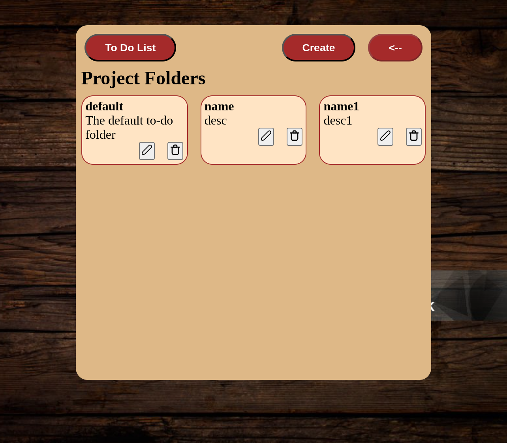
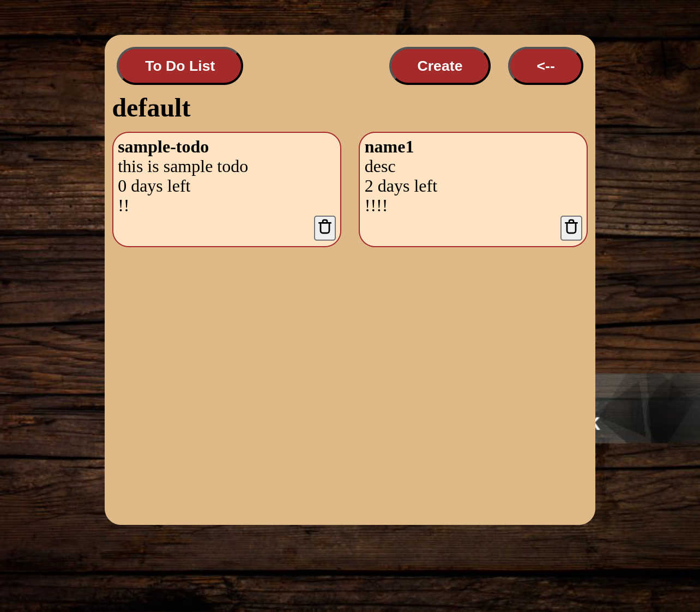

# Odin-ToDo-List
TheOdinProject to build a To-Do List

## Objective
To build a ToDo List using HTML, CSS, HS

## Functionality to be added

Project: 
- [x] Project folder to group the todo-list.
- [x] Project have Name, Descrition
- [x] List Project Folders
- [x] Able to create/update/remove project folder
- [x] Alert on DELETE of Project folder, ask user if we can DELETE

To-Do:
- [x] Every to-do item have a title, description, dueDate, priority
- [x] List the To-Do List
- [x] Able to create/delete the To-Do Items inidividually

## Result

